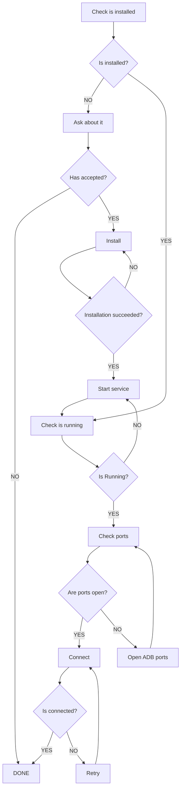

# C3PO - The Android Explorer

<p align="center">
  
</p>

<p align="center">
  <strong>A comprehensive desktop application for Android development and debugging</strong>
</p>

<p align="center">
  
  
  
</p>

## Overview

**C3PO** is a powerful desktop application built with Kotlin and Jetpack Compose Desktop that serves as a comprehensive Android device exploration and management tool. Named after the helpful protocol droid from Star Wars, C3PO acts as your companion for exploring and understanding Android systems and applications.

The application provides developers with an intuitive graphical interface to interact with Android devices connected via ADB (Android Debug Bridge), offering deep insights into app internals, system components, and device management.

## Key Features

### 🔌 Device Management
- **Multi-device Support**: Connect and manage multiple Android devices simultaneously
- **ADB Integration**: Seamless Android Debug Bridge connectivity
- **Port Management**: Automatic ADB port forwarding and connectivity handling
- **Device Status Monitoring**: Real-time device connection status and health checks

### 📱 Package Management
- **Comprehensive Package Listing**: View all installed Android applications
- **Detailed Package Information**: Access package names, versions, version codes, and metadata
- **Package Actions**:
  - Stop running applications
  - Uninstall packages
  - Clear application data
  - Extract signing key information
  - Monitor app sleep states

### 🔍 Android System Exploration

C3PO features a robust plugin-based architecture that enables deep Android system exploration:

#### Available Plugins
- **📋 Activities Plugin**: Explore and manage Android activities
- **⚙️ Services Plugin**: Interact with system and app services
- **🔐 Permissions Plugin**: View and analyze app permissions
- **📨 Intents Plugin**: Work with Android intents and intent filters
- **🏷️ Attributes Plugin**: Examine application attributes and metadata
- **🔑 Signature Plugin**: Analyze application signing information and certificates

## Technical Architecture

### Core Technologies
- **UI Framework**: Jetpack Compose Desktop for modern, native desktop experience
- **Language**: Kotlin 2.0.0 with full coroutines support
- **Architecture Pattern**: Redux-like pattern with Actions, State, and Middleware
- **Dependency Injection**: Koin 4.0.2 for clean dependency management
- **Socket Communication**: Custom socket client for device communication
- **Error Tracking**: Sentry integration for crash reporting and monitoring

### Architecture Components

```
┌─────────────────┐    ┌──────────────────┐    ┌─────────────────┐
│   UI Layer      │    │  Core Layer      │    │  Plugin System  │
│  (Compose)      │◄──►│  (Redux Store)   │◄──►│  (Extensible)   │
└─────────────────┘    └──────────────────┘    └─────────────────┘
         │                       │                       │
         ▼                       ▼                       ▼
┌─────────────────┐    ┌──────────────────┐    ┌─────────────────┐
│   Middleware    │    │   State Manager  │    │   ADB Commands  │
│   Pipeline      │    │   (AppState)     │    │   (Executor)    │
└─────────────────┘    └──────────────────┘    └─────────────────┘
```

### Plugin Architecture

The plugin system enables extensible functionality:

```kotlin
interface Plugin<in T> {
    val id: String
    val name: String
    val middleware: IMiddleware<AppState>

    fun isResponsibleFor(action: IAction): Boolean

    @Composable
    fun render(state: Map<String, WindowResult<*>>, onAction: OnAction)

    @Composable
    fun present(result: WindowResult<T>, onAction: OnAction)
}
```

## Installation & Setup

### Prerequisites
- **Java 17+**: Required for running the application
- **ADB**: Android Debug Bridge must be installed and accessible
- **Android Device**: Physical device or emulator with USB debugging enabled

### Building from Source

```bash
# Clone the repository
git clone <repository-url>
cd c3po

# Build the application
./gradlew build

# Run the application
./gradlew run

# Create distributable package (macOS)
./gradlew packageDmg
```

### System Requirements
- **macOS**: 10.14+ (primary target platform)
- **Memory**: Minimum 512MB RAM
- **Storage**: 100MB available space

## Usage

### Getting Started

1. **Launch C3PO**: Start the application from your applications folder or command line
2. **Connect Device**: Ensure your Android device is connected via USB with debugging enabled
3. **Device Selection**: Select your target device from the device selector dropdown
4. **Explore**: Choose from available plugins to explore different aspects of your device

### Device Connection Flow

The application follows this connection workflow:



### Plugin Usage

Each plugin provides specialized functionality:

- **Packages**: Manage installed applications, view signatures, control app lifecycle
- **Activities**: Launch activities, view activity stacks, manage activity states
- **Services**: Start/stop services, monitor service status
- **Permissions**: Analyze permission usage, identify security concerns
- **Intents**: Test intent filters, broadcast intents, analyze intent handling

## Development

### Project Structure

```
src/
├── main/kotlin/
│   ├── core/              # Core application logic, state management
│   ├── plugins/           # Plugin implementations
│   │   ├── packages/      # Package management plugin
│   │   ├── activities/    # Activities exploration plugin
│   │   ├── services/      # Services management plugin
│   │   ├── permissions/   # Permissions analysis plugin
│   │   └── intents/       # Intents handling plugin
│   ├── ui/                # Compose UI components
│   ├── commands/          # ADB command execution
│   ├── socket/            # Socket communication
│   ├── models/            # Data models and DTOs
│   ├── di/                # Dependency injection modules
│   └── Main.kt            # Application entry point
└── test/                  # Unit and integration tests
```

### Testing

The project includes comprehensive testing:

```bash
# Run all tests
./gradlew test

# Run tests with coverage
./gradlew koverHtmlReport

# Coverage report location: build/reports/kover/html/index.html
```

### Code Quality

- **Static Analysis**: Integrated with pre-commit hooks
- **Test Coverage**: Minimum coverage requirements enforced
- **Code Style**: Kotlin coding conventions

## Contributing

### Adding New Plugins

1. **Create Plugin Directory**: `src/main/kotlin/plugins/yourplugin/`
2. **Implement Plugin Interface**: Extend the base `Plugin<T>` interface
3. **Create Middleware**: Handle plugin-specific actions and state
4. **Register Plugin**: Add to dependency injection configuration
5. **Add Tests**: Include comprehensive unit tests

### Development Guidelines

- Follow Kotlin coding conventions
- Write tests for new functionality
- Update documentation for API changes
- Use meaningful commit messages
- Ensure backward compatibility

## Troubleshooting

### Common Issues

**Device Not Detected**
- Ensure USB debugging is enabled
- Check ADB connection: `adb devices`
- Restart ADB server: `adb kill-server && adb start-server`

**Connection Failures**
- Verify ADB ports are available
- Check device authorization dialog

**Performance Issues**
- Reduce number of simultaneous operations
- Check device storage and memory
- Update to latest ADB version

## License

This project is licensed under the MIT License - see the LICENSE file for details.

## Acknowledgments

- **Jetbrains**: For Kotlin and Compose Desktop
- **Android Team**: For ADB and development tools
- **Community**: For feedback and contributions

---

<p align="center">
  <strong>C3PO - Your faithful Android exploration companion</strong>
</p>
