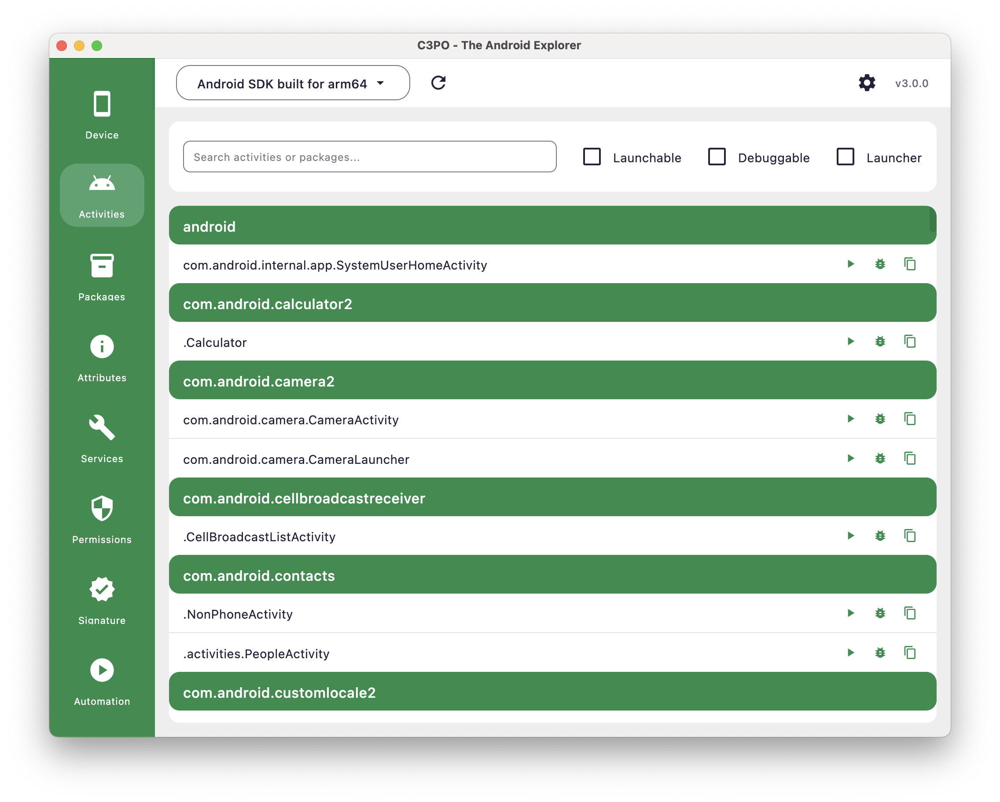
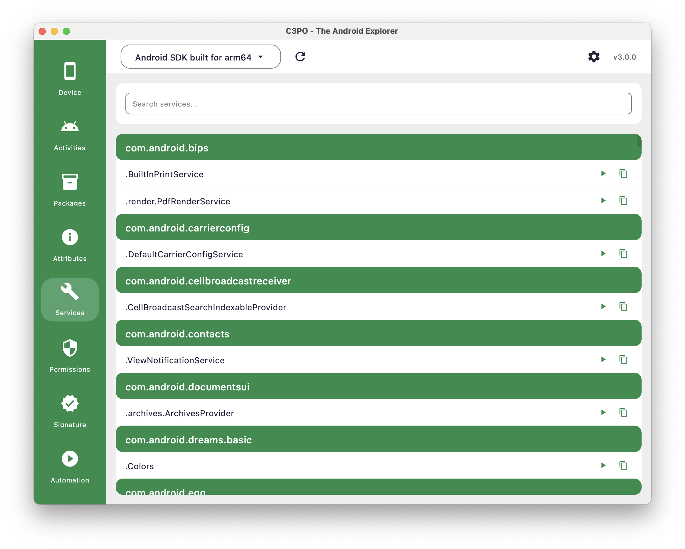

# Activities and Services Management

C3PO provides essential tools for viewing and managing Android's core components - Activities and Services. This guide
covers the Activities and Services plugins, which allow you to list, launch, and manage the fundamental building blocks
of Android applications.

## Understanding Android Components

### Activities Overview

Activities represent single screens or UI components in Android applications. They handle user interactions and manage
the user interface lifecycle.

### Services Overview

Services run background operations without a user interface. They handle long-running tasks, network operations, and
system integrations.

### Intent System

Intents facilitate communication between components, allowing activities to start other activities or services, and
enabling inter-app communication.

## Activities Plugin


*The Activities plugin showing available activities by package*

### Activity Listing and Information

#### What the Activities Plugin Shows

The Activities plugin displays:

- **Package Name:** Application package that contains the activity
- **Activity Path:** The activity class name within the package
- **Full Path:** Complete activity identifier (package/activity)

#### Activity Discovery

The plugin lists activities by:

- Querying installed packages for declared activities
- Displaying activities grouped by their parent package
- Providing search functionality to filter results

### Activity Operations

#### Available Actions

For each activity, you can perform the following operations:

##### Launch Activity

▶️ Start the activity normally

```bash
# Via C3PO: Click launch button for selected activity
# Equivalent ADB command:
adb shell am start -n com.example.app/.MainActivity
```

##### Launch in Debug Mode

🐛 Launch activity with debug options enabled

```bash
# Via C3PO: Click debug button for selected activity
# Equivalent ADB command:
adb shell am start -D -n com.example.app/.MainActivity
```

##### Set as Launcher

🏠 Set the activity as the device's default launcher (available only for launcher-capable activities)

```bash
# Via C3PO: Click home button for launcher-capable activity
# Equivalent ADB command:
adb shell pm set-home-activity com.example.launcher/.MainActivity
```

##### Copy Command

📋 Copy the ADB command to clipboard

### Filtering and Search

#### Search Functionality

The search bar allows filtering by:

- Activity path (class name)
- Package name
- Partial text matching

#### Filter Options

- **Launchable Only:** Show only activities that can be launched directly
- **Debuggable Only:** Show only activities from debuggable applications
- **Launcher Only:** Show only activities that can be set as the device's default launcher

These filters help narrow down the list to relevant activities for your current task.

### Common Use Cases

#### Application Testing

- Launch specific activities to test individual screens
- Use debug mode for development and troubleshooting
- Test deep-linking and activity navigation

#### Development Workflow

- Quickly access specific app screens during development
- Test activity launch behavior
- Verify activity declarations and accessibility

#### Launcher Management

- Filter and identify launcher applications installed on the device
- Switch between different launcher apps for testing
- Set custom launchers for development and testing scenarios
- Test launcher functionality and home screen behavior

## Services Plugin


*Services plugin showing available services by package*

### Service Listing and Information

#### What the Services Plugin Shows

The Services plugin displays:

- **Package Name:** Application package that contains the service
- **Service Path:** The service class name within the package
- **Full Path:** Complete service identifier (package/service)

#### Service Organization

Services are:

- Grouped by their parent package
- Listed with their complete class path
- Searchable by name or package

### Service Operations

#### Available Actions

##### Launch Service

▶️ Start the service

```bash
# Via C3PO: Click launch button for selected service
# Equivalent ADB command:
adb shell am startservice com.example.app/.MyService
```

**Note:** Service launching behavior depends on the service implementation and Android version. Modern Android versions
have restrictions on background service execution.

### Search and Navigation

#### Search Functionality

Filter services by:

- Service class name
- Package name
- Partial text matching

#### Service Discovery

The plugin helps you:

- Identify available services in installed applications
- Find specific services for testing or analysis
- Understand service structure within applications

## Best Practices

### Effective Component Management

1. **Use Search Efficiently**
    - Filter by package name when working with specific apps
    - Use partial matching to find activities quickly
    - Apply filters to focus on relevant components

2. **Safe Testing Practices**
    - Test activities in debug mode when developing
    - Use explicit component names to avoid conflicts
    - Verify permissions before launching components

3. **Development Workflow**
    - Use C3PO to quickly access app screens during development
    - Copy ADB commands for automation scripts
    - Test component accessibility and launch behavior

### Troubleshooting Component Issues

#### Activity Launch Problems

- **Symptoms:** Activity doesn't start or shows errors
- **Solutions:**
    - Verify the activity exists and is declared in manifest
    - Check if the activity requires specific permissions
    - Ensure the parent application is installed and enabled

#### Service Start Issues

- **Symptoms:** Service won't start or fails immediately
- **Solutions:**
    - Check Android version compatibility (background service restrictions)
    - Verify service permissions and declarations
    - Consider foreground service requirements for newer Android versions

#### Component Not Found

- **Symptoms:** Expected activities or services don't appear in lists
- **Solutions:**
    - Refresh the plugin by switching away and back
    - Verify the application is properly installed
    - Check if components are declared as exported in manifest

## Command Line Integration

C3PO component operations correspond to standard ADB commands:

```bash
# Launch activity
adb shell am start -n com.example.app/.MainActivity

# Launch activity in debug mode
adb shell am start -D -n com.example.app/.MainActivity

# Start service
adb shell am startservice com.example.app/.MyService

# Query launcher activities
adb shell "cmd package query-activities -a android.intent.action.MAIN -c android.intent.category.HOME --brief --user 0"

# Set default launcher
adb shell pm set-home-activity com.example.launcher/.MainActivity

# Send custom intent
adb shell am start -a android.intent.action.VIEW -d "content://example"

# Broadcast intent
adb shell am broadcast -a com.example.CUSTOM_ACTION
```

## Limitations and Considerations

### Current Capabilities

The Activities and Services plugins provide:

- Basic component listing and information display
- Simple launch functionality for activities and services
- Search and filtering capabilities
- Command generation for manual operations

### Android Version Considerations

- **Service Limitations:** Modern Android versions restrict background service execution
- **Permissions:** Some components may require specific permissions to launch
- **Security:** System components may be protected from external launching

---

**Related Guides:**

- [Package Management Deep Dive](Package-Management-Deep-Dive.html)
- [Security and Permissions Analysis](Security-and-Permissions-Analysis.html)
- [Device Information and Monitoring](Device-Information-and-Monitoring.html)