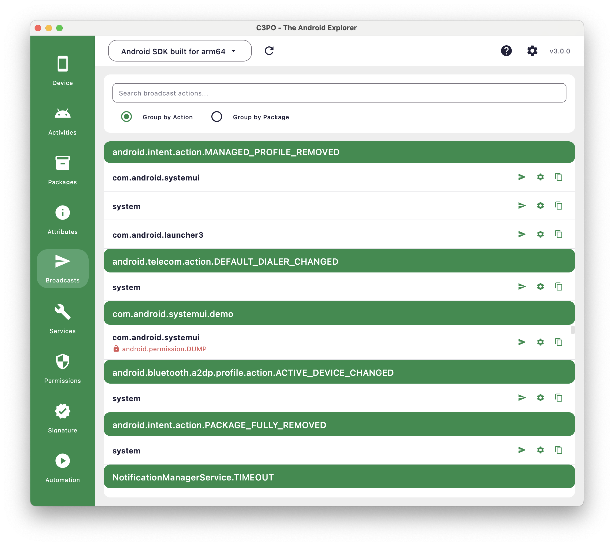
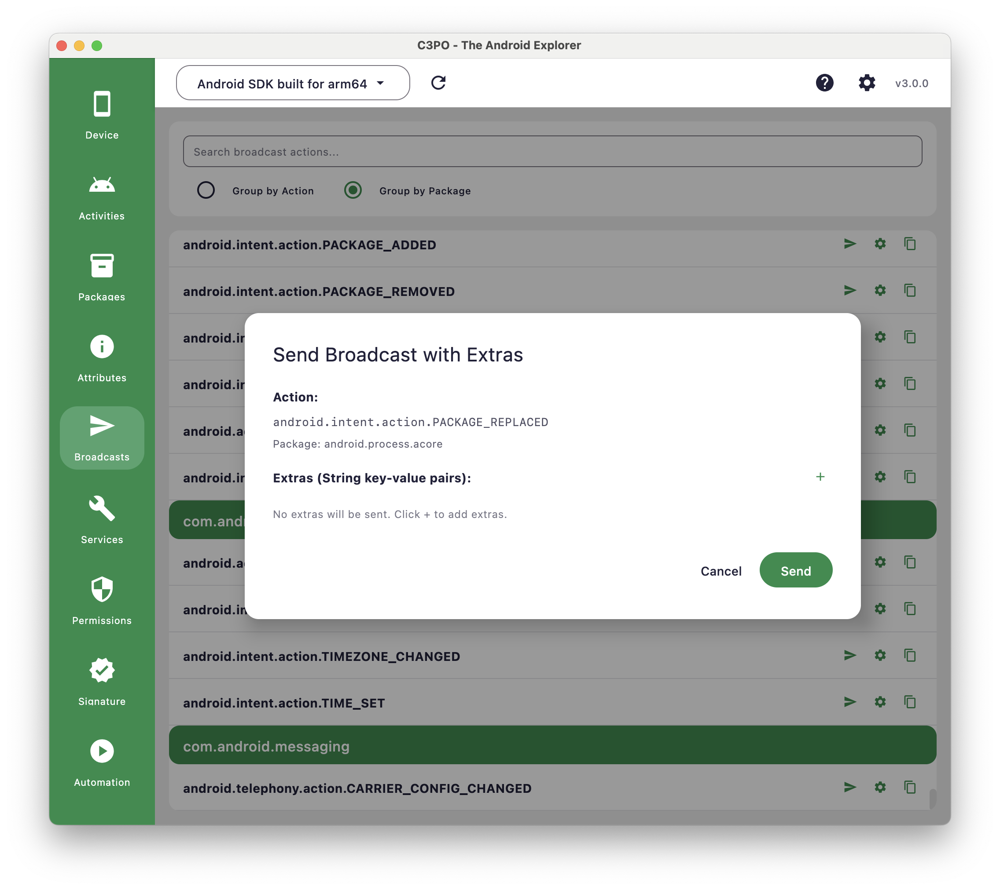

# Broadcasts Plugin

The Broadcasts plugin surfaces the receivers that are currently registered on the connected device and lets you test
them directly from the desktop app. It is ideal for validating implicit intents, reproducing broadcast-driven flows, or
understanding what each foreground app has made available at runtime.

## When to Reach for This Plugin

Use the Broadcasts view when you need to:

- Inspect which packages are listening for a particular broadcast action right now
- Compare runtime registrations across applications without digging through `dumpsys` output manually
- Trigger receivers during debugging sessions, either immediately or with crafted extras
- Capture the exact `adb shell am broadcast` command for reuse in terminals and CI scripts

> ℹ️ The receivers list reflects a snapshot of the running system. Some entries only appear while the originating
> application or service is active, so keep the target app open when refreshing the list.

## Exploring Registered Receivers

### Grouping and Filtering

At the top of the screen, use **Group by Action** or **Group by Package** to pivot the list around the dimension that
best
fits your investigation. The search field filters by action name, package, or required permission once you enter two or
more characters.

### Permission Badges

Rows surface a lock icon when a receiver demands a permission. This helps you decide whether you can trigger it directly
or need elevated privileges first.

## Sending Broadcasts

Each receiver row exposes three quick actions:

- **Send broadcast** – Dispatches the intent immediately with no extras.
- **Send with extras** – Opens a dialog where you can declare string extras, preview the generated ADB command, and send
  everything in one click.
- **Copy ADB command** – Places the full `adb shell am broadcast` invocation on your clipboard for manual execution.

The send dialog keeps a live command preview so you can confirm casing, quoting, and the sequence of extras before you
run the broadcast. After executing, C3PO reports the parsed output so you know whether the device accepted the intent or
rejected it due to permission errors.

## Common Scenarios

- Trigger `CONNECTIVITY_CHANGE` or similar system broadcasts while validating receiver logic.
- Wake up in-app schedulers that listen for custom actions during instrumentation tests.
- Share a reproducible "copy/paste" command with teammates when a receiver misbehaves on certain builds.

## Troubleshooting Tips

- **Empty results:** Ensure the target app is running; otherwise its receivers may not be registered.
- **Permission denied:** The required permission is shown next to the entry. Grant it (or use a profile with the needed
  capability) before retrying.
- **Unexpected results:** Refresh the plugin after foregrounding the device or toggling the app state—registrations can
  change quickly during development.

## Screenshots

*Grouped view of currently registered receivers*

*Dialog for composing extras and previewing the ADB command*
