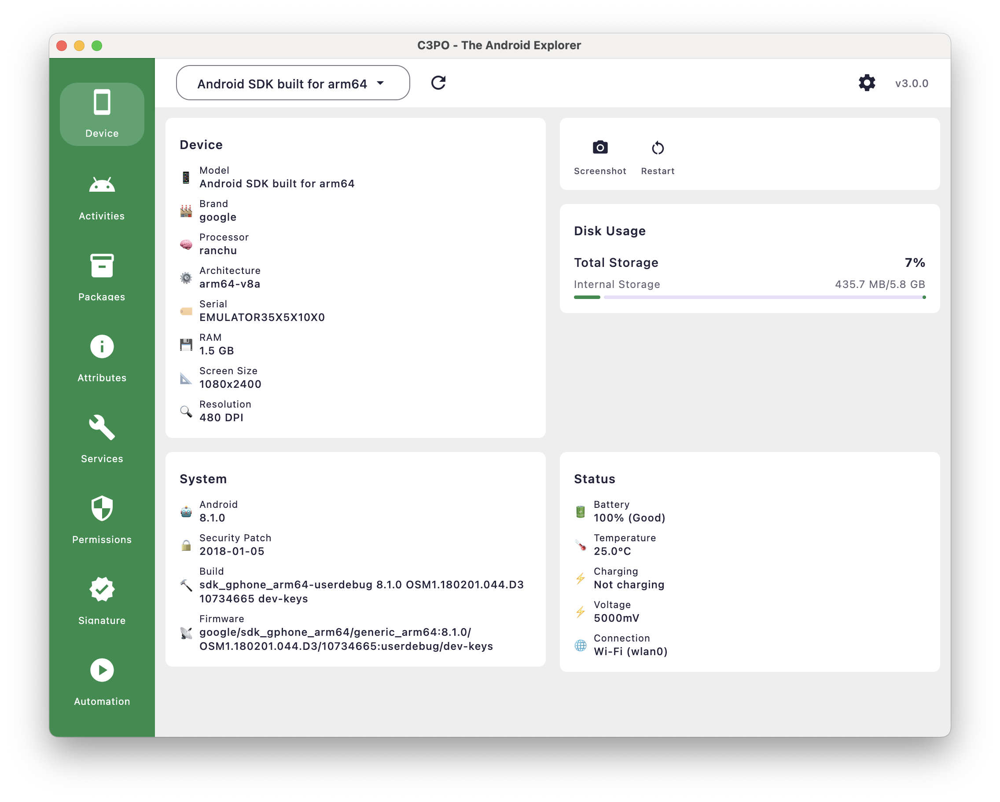

# Device Information and Monitoring

C3PO's Device plugin provides essential hardware and system information about connected Android devices, giving
developers a clear snapshot of device capabilities and current status for effective development and troubleshooting.

## Device Information Overview

*Device information dashboard showing hardware specs, system details, storage usage, and device status*

The Device plugin serves as your comprehensive device dashboard, providing essential information for:

- **Hardware Analysis:** Understanding device specifications and capabilities
- **System Overview:** Current Android version and build information
- **Status Monitoring:** Real-time battery, storage, and connection status
- **Development Planning:** Key specifications for app compatibility and optimization

## Interface Layout

The Device plugin presents information in a clean 4-card layout:

### **Device Card** (Top Left)

Essential hardware specifications and device identity

### **Disk Usage Card** (Top Right)

Storage capacity and usage visualization with percentage indicator

### **System Card** (Bottom Left)

Android version, security patch, build, and firmware information

### **Status Card** (Bottom Right)

Real-time battery status, connection mode, and device health

## Hardware Information

### Device Specifications

The Device card displays core hardware information:

#### Device Identity

- **Model:** Device model name (e.g., "Android SDK built for arm64")
- **Brand:** Device manufacturer (Google, Samsung, OnePlus, etc.)
- **Serial:** Device serial number for identification
- **Processor:** CPU name and type (e.g., "ranchu")
- **Architecture:** System architecture (arm64-v8a, x86, etc.)

#### Memory and Display

- **RAM:** Total system memory (e.g., "1.5 GB")
- **Screen Size:** Display resolution (e.g., "1080x2400")
- **Resolution:** Screen density in DPI (e.g., "480 DPI")

## Storage Information

### Disk Usage Analysis

*Disk usage visualization showing storage capacity and availability*

The Disk Usage card provides storage insights:

#### Storage Metrics

- **Total Storage:** Complete storage capacity of the device
- **Usage Percentage:** Visual percentage indicator of used space
- **Available Space:** Remaining storage in GB/MB format
- **Internal Storage:** Primary device storage information

#### Storage Visualization

- **Progress Bar:** Visual representation of storage usage
- **Color Coding:** Green for healthy usage levels
- **Percentage Display:** Clear numerical usage indicator

## System Information

### Android System Details

The System card shows essential OS information:

#### Operating System

- **Android Version:** Current Android release (e.g., "8.1.0")
- **Security Patch:** Latest security update date (e.g., "2018-01-05")
- **Build:** Complete build identifier with version details
- **Firmware:** System firmware version and build information

#### Build Information

- **Build String:** Detailed build identifier showing:
    - Device codename
    - Architecture
    - Build type and version
    - Build timestamp
    - Developer keys information

## Device Actions

### Device Control Operations

The Device plugin provides convenient action buttons for direct device control:

#### Screenshot Capture

Take an instant screenshot of your connected device's current screen. Click the screenshot button to capture what's
currently displayed on the device. Screenshots are automatically saved to your local machine for immediate use.

**Key Features:**

- Instant screen capture with one click
- Automatic local storage and cleanup
- Perfect for documentation, bug reports, or testing workflows

#### Device Restart

Restarts your connected Android device when needed. Click the restart button to safely reboot the device - you'll be
asked to confirm before the restart proceeds.

**Key Features:**

- Safe remote device restart
- Confirmation dialog prevents accidental restarts
- Automatic reconnection when device comes back online

## Device Status

### Real-Time Status Monitoring

*Live device status showing battery, temperature, and connection information*

The Status card displays current device state:

#### Battery Information

- **Battery Level:** Current charge percentage with health status
- **Temperature:** Device temperature in Celsius
- **Charging Status:** Current charging state (charging/not charging)
- **Voltage:** Battery voltage in millivolts
- **Health Status:** Battery condition (Good, Poor, etc.)

#### Connection Status

- **Connection Mode:** Current connectivity method
- **Network Type:** WiFi, Mobile Data, or other connection details
- **Interface Information:** Network interface details when available

---

**Related Guides:**

- [Getting Started Guide](Getting-Started-Guide.html)
- [Package Management Deep Dive](Package-Management-Deep-Dive.html)
- [Troubleshooting and FAQ](Troubleshooting-and-FAQ.html)