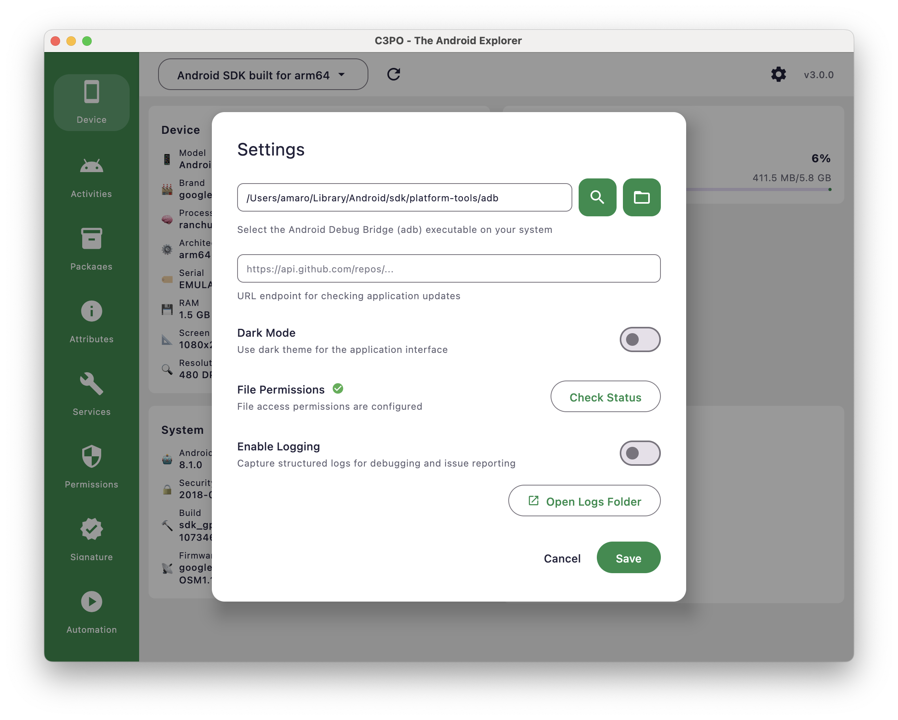

# Getting Started Guide

This comprehensive guide walks you through setting up C3PO, from installation to connecting your first Android device. Follow each section in order for the smoothest experience.

## Prerequisites Check

Before installing C3PO, ensure your system meets the requirements:

### System Requirements

- **macOS**: 10.14 Mojave or later
- **Architecture**: Apple Silicon (M1/M2/M3)
- **Memory**: Minimum 512MB RAM available
- **Storage**: 150MB free space
- **Java**: Version 17 or later (bundled with the app)

### Check Your System

```bash
# Check macOS version
sw_vers

# Check architecture
uname -m
# Output: arm64 (Apple Silicon)

# Check available space
df -h /Applications
```

## Installation Methods

### Method 1: Pre-built Release (Recommended)

1. **Download:**
    - Visit [GitHub Releases](https://github.com/amaro-dev/c3po/releases)
    - Download `c3po-X.X.X-macos.dmg`
    - Choose the latest stable version

2. **Install:**
   ```bash
   # Option A: Command line
   open c3po-*.dmg
   
   # Option B: Double-click the DMG file
   ```

3. **Security Setup:**
    - Drag C3PO to Applications folder
    - First launch may show security warning
    - Go to System Preferences > Security & Privacy
    - Click "Open Anyway" for C3PO

### Method 2: Build from Source

For developers who want to build from source:

```bash
# Clone repository
git clone https://github.com/amaro-dev/c3po.git
cd c3po

# Verify Java version
java --version
# Should show Java 17 or later

# Build application
./gradlew clean build

# Run directly for testing
./gradlew run

# Create DMG for installation
./gradlew packageDmg
```

## First Launch

### Initial Setup Wizard

When you first launch C3PO, you'll see:

1. **Welcome Screen:**
    - Introduction to C3PO features
    - System requirements check
    - ADB installation verification

2. **ADB Setup Check:**
    - Automatic detection of ADB installation
    - Guidance if ADB is not found
    - PATH configuration assistance

3. **Device Connection:**
    - Instructions for enabling USB debugging
    - Device authorization process
    - Connection verification

## Configuring ADB Location


*ADB configuration dialog that appears on first launch*

The first time you launch C3PO, it will automatically present the ADB Setup dialog to help you configure the Android
Debug Bridge location. This is a critical step that ensures C3PO can communicate with your Android devices.

### ADB Setup Options

#### Option 1: Automatic Search (Recommended)

The easiest way to configure ADB is to let C3PO find it automatically:

1. **Click the 🔍 Search button**
2. **Wait for automatic detection** (usually takes 5-10 seconds)
3. **Review the found path** in the text field
4. **Click "Test Connection"** to verify ADB works

**Search Locations:**
C3PO uses the `which adb` command to locate its path

#### Option 2: Manual Path Entry

If you know exactly where ADB is installed:

1. **Type or paste the full ADB path** into the text field
2. **Common paths:**
   ```bash
   # Homebrew on Apple Silicon
   /opt/homebrew/bin/adb

   # Android SDK (default location)
   ~/Library/Android/sdk/platform-tools/adb

   # Manual installation
   /usr/local/platform-tools/adb
   ```

#### Option 3: Browse for ADB

For a visual approach to finding ADB:

1. **Click the 📁 Browse button**
2. **Navigate to your ADB installation directory**
3. **Select the `adb` executable file**
4. **Click "Open"** to confirm selection
5. **Click "Test Connection"** to verify

### ADB Verification Process

Once you've set the ADB path, C3PO will automatically:

1. **Test ADB Execution** - Verify the ADB executable runs correctly
2. **Display Connection Status** - Show whether ADB is working properly
3. **Navigate to Device Plugin** - Open the main device interface if successful

### Troubleshooting ADB Setup

#### "ADB Not Found" Error

**Symptoms:**

- Red error message: "ADB executable not found at specified path"
- Search button finds nothing
- Manual path entry shows error

**Solutions:**

```bash
# Verify ADB is actually installed
which adb
# If no output, ADB is not in your PATH

# Check common installation locations
ls /opt/homebrew/bin/adb         # Apple Silicon Homebrew

ls ~/Library/Android/sdk/platform-tools/adb  # Android SDK

# Install ADB if not found
brew install android-platform-tools
```

#### "Permission Denied" Error

**Symptoms:**

- ADB path is correct but shows permission error
- Test connection fails with access denied

**Solutions:**

```bash
# Make ADB executable
chmod +x /path/to/adb

# Check file permissions
ls -la /path/to/adb

# Grant full disk access to C3PO (macOS Security & Privacy)
```

#### "ADB Server Issues" Error

**Symptoms:**

- ADB found but server won't start
- Connection test shows server errors

**Solutions:**

```bash
# Kill existing ADB server
adb kill-server

# Restart ADB server
adb start-server

# Check for port conflicts
lsof -i :5037
```

### Reconfiguring ADB Later

You can change the ADB location anytime after initial setup:

1. **Open C3PO Preferences:**

2. **Update and Test:**
    - Change path using any of the three methods
    - Save changes

## macOS Permission Setup

### File Access Permissions (macOS Only)

For file dialogs to work properly in C3PO (such as selecting APK files or opening script folders), you'll need to grant
file access permissions on macOS:

#### Quick Setup

1. **Open System Preferences** (or **System Settings** on macOS 13+)
2. Go to **Security & Privacy** → **Privacy**
3. Select **"Files and Folders"** from the left sidebar
4. Look for **C3PO** in the applications list
5. Check the boxes for:
    - ✅ **Documents Folder**
    - ✅ **Downloads Folder**
    - ✅ **Desktop Folder**

#### If C3PO Doesn't Appear in the List

Sometimes C3PO won't appear in the Files and Folders list until you've tried using a file dialog first:

1. **Launch C3PO** and complete ADB setup
2. **Try using a file dialog** (e.g., open Automation plugin and try "Open Script")
3. **Go back to System Preferences** and look for C3PO in the list
4. **Grant permissions** as described above

#### Alternative: Full Disk Access

If the above doesn't work, you can grant broader permissions:

1. In **Security & Privacy** → **Privacy**
2. Select **"Full Disk Access"**
3. Click the **"+"** button
4. Navigate to and select the **C3PO application**

#### Verify Permissions

After granting permissions:

1. **Restart C3PO** completely
2. **Open Settings** in C3PO
3. **Look for "File Permissions"** section
4. **Click "Check Status"** to verify access is working

**Note:** This setup is only needed on macOS. Other operating systems don't require this step.

## Connecting Your First Device

### Step 1: Prepare Your Android Device

1. **Enable Developer Options:**
   ```
   Settings > About Phone > Tap "Build Number" 7 times
   ```

2. **Enable USB Debugging:**
   ```
   Settings > Developer Options > USB Debugging (ON)
   ```

3. **Optional: Enable Wireless Debugging:**
   ```
   Settings > Developer Options > Wireless debugging (ON)
   ```

### Step 2: Physical Connection

1. **Connect via USB:**
    - Use a data cable (not charge-only)
    - Connect to your Mac
    - Watch for device notifications

2. **Authorize Connection:**
    - Device will show "Allow USB debugging?" dialog
    - Check "Always allow from this computer"
    - Tap "OK"

### Step 3: Verify Connection

```bash
# Open terminal and verify ADB connection
adb devices

# Expected output:
# List of devices attached
# ABC123DEF456    device
```

If you see "unauthorized" instead of "device":

1. Check device screen for authorization dialog
2. Disable and re-enable USB debugging
3. Try a different USB port/cable

## Understanding the Interface


*Device connection and information display*

### Main Components

1. **Top Bar:**
    - Device selector dropdown
    - Connection status indicator
    - Settings and help buttons

2. **Sidebar (Left):**
    - Plugin navigation

3. **Main Content Area:**
    - Plugin-specific interface
    - Data tables and forms
    - Action buttons and controls

4. **Status message:**
    - Current operation status
    - Progress indicators
    - Error messages and notifications

### Device Selector

The device dropdown shows:

- **Device Name:** Device name as configured
- **Connection Status:** Indicates device availability

### Plugin Navigation

Available plugins in sidebar:

- 📦 **Packages:** App management
- 📋 **Activities:** Activity debugging
- ⚙️ **Services:** Service management
- 🔐 **Permissions:** Security analysis
- 🏷️ **Attributes:** Device properties
- 🔑 **Signature:** APK signing
- 🤖 **Automation:** Custom scripts

## Your First Actions

### 1. Explore Device Information

- Click the Device plugin in the sidebar
- Review hardware specifications
- Check Android version and security patch
- Note storage and memory information
- You can copy some of these information by hovering the cursor and using the copy button

### 2. Browse Installed Apps

- Click "Packages" in the sidebar
- Scroll through installed applications
- Click any app to see detailed information
- Try filtering by system/user apps

### 3. Test an Action

- Select a user-installed app
- Click the "Force Stop" button
- Confirm the action
- Observe the result in the status bar

### 4. Check Permissions

- Click "Permissions" in the sidebar
- You can see a list of available permission in this device
- You can search for one specific permission or use the filter

## Next Steps

Once you're comfortable with basic operations:

1. **Read Feature Guides:**
    - [Package Management Deep Dive](Package-Management-Deep-Dive.html)
    - [Activities and Services Management](Activities-and-Services-Management.html)
    - [Security and Permissions Analysis](Security-and-Permissions-Analysis.html)

2. **Explore Advanced Features:**
    - [Device Information and Monitoring](Device-Information-and-Monitoring.html)
    - [Automation and Scripting](Automation-and-Scripting.html)

3. **Troubleshooting:**
    - [Troubleshooting and FAQ](Troubleshooting-and-FAQ.html)

**Next:** Continue to [Package Management Deep Dive](Package-Management-Deep-Dive.html) to learn about comprehensive app
management features.