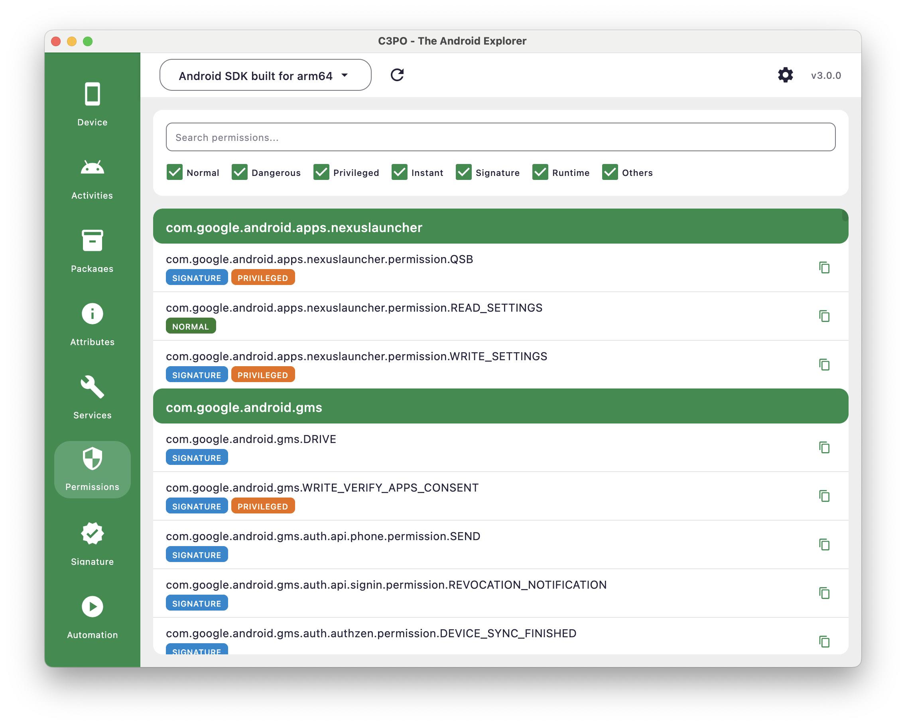
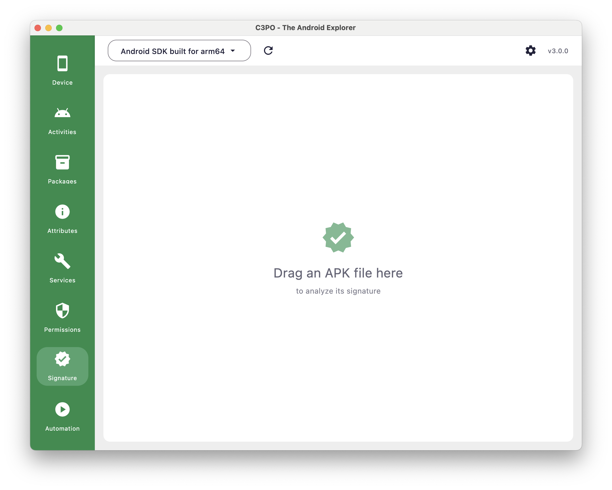
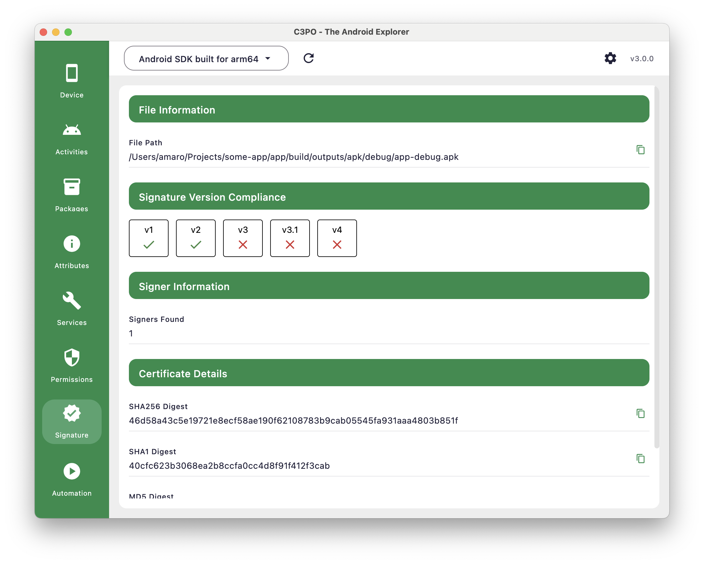

# Security and Permissions Analysis

C3PO provides essential security analysis tools through its Permissions and Signature plugins, enabling developers to
examine system permissions and validate APK signatures for security assessment and development planning.

## Overview

C3PO's security analysis capabilities include:

- **System Permissions:** Browse and filter device-wide permission declarations
- **APK Signature Analysis:** Examine signing certificates and signature compliance
- **Certificate Verification:** View signing certificate details and fingerprints
- **Protection Level Filtering:** Organize permissions by security classification

## Permissions Plugin

*Permissions plugin interface showing system-wide permission declarations with filtering capabilities*

### Permission System Overview

The Permissions plugin provides a comprehensive view of all permissions declared across applications on your connected
device, organized by the applications that declare them.

#### Interface Features

- **Search Functionality:** Filter permissions by name using the search bar
- **Protection Level Filters:** Toggle visibility for different permission types
- **Application Grouping:** Permissions are organized by declaring application
- **Copy Support:** Copy permission names to clipboard for reference

### Permission Filtering

#### Protection Level Categories

The plugin allows filtering by these permission categories:

- **Normal:** Basic functionality permissions automatically granted
- **Dangerous:** Sensitive permissions requiring user consent
- **Privileged:** System-level permissions for privileged applications
- **Instant:** Permissions available to instant apps
- **Signature:** Permissions granted only to apps with matching signatures
- **Runtime:** Permissions that can be granted/revoked at runtime
- **Others:** Additional permission classifications

#### Filter Controls

Use the checkbox filters to show or hide specific permission types:

- All filters are enabled by default showing complete permission inventory
- Disable specific categories to focus on particular permission types
- Search function works in combination with active filters

### Permission Display

#### Application Sections

Permissions are grouped under declaring applications:

- **Application Header:** Shows the package name of the permission-declaring app
- **Permission List:** Individual permissions declared by that application
- **Protection Badges:** Visual indicators showing permission classification
- **Copy Function:** Click copy icon to copy permission names

#### Permission Information

Each permission entry displays:

- **Permission Name:** Full permission identifier (e.g., com.google.android.gms.DRIVE)
- **Protection Level:** Color-coded badges indicating permission classification
- **Declaring App:** The application that declares this permission

## Signature Plugin

*Signature plugin drag-and-drop interface for APK analysis*

### APK Signature Analysis

The Signature plugin provides drag-and-drop APK analysis to examine signing certificates and signature compliance for
any APK file.

#### Getting Started

1. **Drag and Drop:** Drop an APK file onto the signature analysis area
2. **File Loading:** C3PO automatically processes the APK signature information
3. **Results Display:** View comprehensive signature analysis results

### Signature Analysis Results

*Signature analysis results showing file information, signature compliance, and certificate details*

#### File Information

- **File Path:** Complete path to the analyzed APK file
- **Copy Support:** Copy file path to clipboard for reference

#### Signature Version Compliance

Visual indicators showing APK signature scheme support:

- **v1 Signature:** JAR signing scheme compatibility
- **v2 Signature:** APK Signature Scheme v2 support
- **v3 Signature:** APK Signature Scheme v3 with key rotation
- **v3.1 Signature:** Enhanced v3.1 scheme support
- **v4 Signature:** Incremental delivery signature scheme

**Compliance Indicators:**

- ✅ **Supported:** APK includes this signature scheme
- ❌ **Not Supported:** APK does not include this signature scheme

#### Signer Information

- **Signers Found:** Number of signing certificates detected in the APK
- **Certificate Count:** Total certificates used for APK signing

#### Certificate Details

**Certificate Fingerprints:**

- **SHA256 Digest:** Primary certificate fingerprint for verification
- **SHA1 Digest:** Legacy certificate fingerprint
- **MD5 Digest:** Additional fingerprint for compatibility
- **Copy Function:** Copy certificate fingerprints to clipboard

---

**Related Guides:**

- [Getting Started Guide](Getting-Started-Guide.md)
- [Package Management Deep Dive](Package-Management-Deep-Dive.md)
- [Activities and Services Management](Activities-and-Services-Management.md)